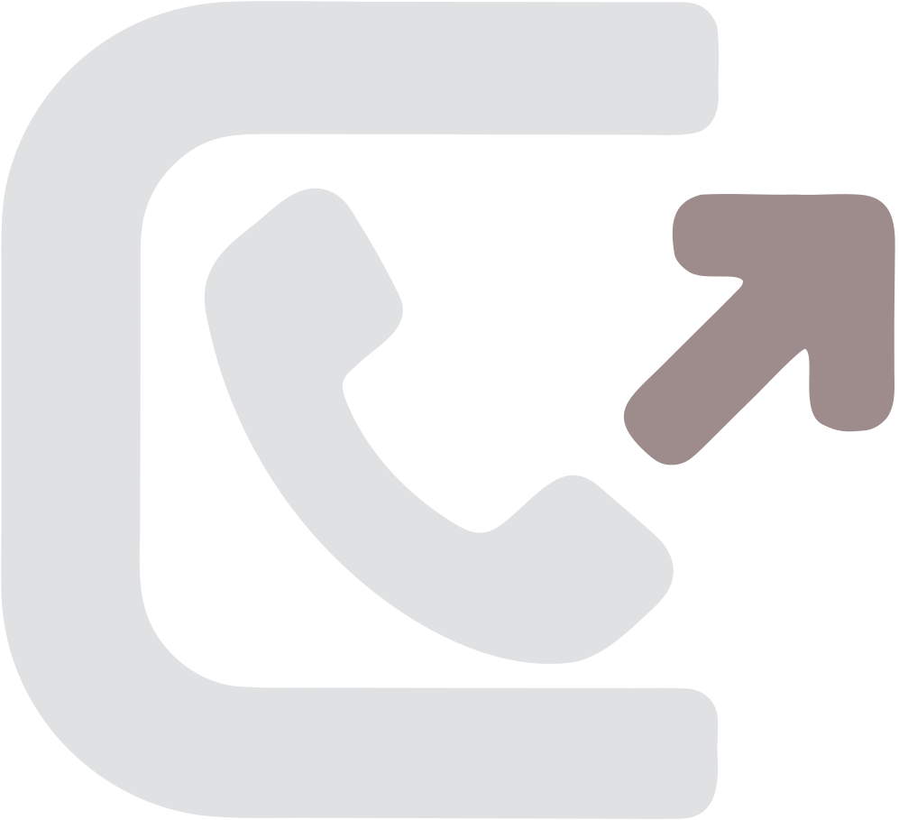

<p align="center">
  
</p>

<h1 align="center">callhook</h1>

<p align="center"><em>Fire a webhook. Your customer's phone rings.</em></p>

<p align="center">
  <a href="https://github.com/iSundram/callhook/actions/workflows/ci.yml"></a>
  <a href="https://github.com/iSundram/callhook/releases"></a>
  <a href="https://callhook.github.io"></a>
  <a href="LICENSE"></a>
  
</p>

---

**Event-driven AI phone calls.** Your system fires a webhook; callhook places an
intelligent phone call via [CALL-E](https://heycall-e.com) and POSTs a
structured outcome back. No scripts, no robocalls — a voice agent that knows
the customer's context before it dials.

## Campaigns — goal-driven calling

One event → one call is the primitive. **Campaigns** are the engine on top:
declare a *goal* and an *audience*, and callhook orchestrates waves of calls
that **stop the moment the goal is met** — never wasting a call.

```bash
curl -X POST localhost:8080/api/campaigns -d '{
  "name": "September collections",
  "event_type": "invoice.due",
  "goal":   { "type": "count", "target": 5, "success_outcomes": ["payment_promised"] },
  "audience_source": "all_overdue",
  "waves":  { "size": 3, "delay": "15m", "max_waves": 5 },
  "budget": { "max_calls": 40 }
}'
```

- **Early-stop** — the instant the target number of successes lands, the rest
  of the audience is skipped. (E2E verified: goal met in 12 of 15 budgeted
  calls, 18 people never called.)
- **Smart requeue** — `no_answer` entries return to the pool for the next wave
  (max 2 rounds per person)
- **Budget hard-stop** — never burns more calls than you allow
- **`reach_all` goals** — "contact every account holder" campaigns too
- **Live war-room dashboard** — progress bar, wave log, per-recipient states
- Campaigns are crash-safe too: journal-persisted, waves resume after restart

> **The voice channel as an API.** Most phone-agent projects are one
> workflow: confirm an appointment, fill a shift, chase one invoice. callhook
> is the layer underneath: point *any* business system at one endpoint,
> fire *any* event type, and get intelligent calls with structured outcomes
> back — with retry policy, polite calling hours, crash-safe persistence,
> and a full audit trail included.

```
business app ──POST /api/events──► callhook ──CALL-E API──► 📞 customer
     ▲                                │
     └── outcome webhook ◄────────────┘
         {outcome, promise_date, actions, transcript, confidence}
```

## How it works

1. **Event in** — any system POSTs an event (`invoice.due`, `account.warning`,
   `promo.offer`, ...). Idempotent: the same event never calls twice, even
   across server restarts.
2. **Prefetch** — the full customer record (plan, invoice, payment history) is
   loaded *before* dialing and baked into the call task, so the voice agent
   never wastes seconds asking for account details.
3. **Intelligent call** — CALL-E's voice agent runs the conversation with that
   context: handles "I already paid" gracefully, collects promise dates,
   offers callbacks.
4. **Structured outcome** — a JSON-Schema-validated result is extracted from
   the call evidence (`payment_promised`, `claims_already_paid`, `no_answer`, ...).
5. **Policy-gated actions** — unambiguous outcomes write to the business store
   (`mark_promise`); uncertain ones escalate to a human instead of acting.
   Every action is audit-logged.
6. **Loop closed** — the outcome, actions taken, transcript, and confidence
   are POSTed back to the originating system.

## Operational guarantees

| Guarantee | How |
|---|---|
| Never double-dial | Per-attempt idempotency keys + event dedup persisted across restarts |
| Crash-safe | Append-only JSONL journal; sessions, armed retries and schedules replay on boot |
| Polite hours | Calls and redials deferred to 9:00–20:00 recipient-local, weekdays (per-region timezone, overridable per event) |
| Courtesy retries | `no_answer` redials up to 2 times; refusals and blocked/invalid numbers are never redialed |
| Scheduled calls | `not_before` on any event parks it until the requested time |
| Not forgeable | Webhook shared secret (`X-Callhook-Secret`) + bearer-token intake (set both on a public tunnel) |
| Flood-safe | Per-source rate limiting on event intake (60/min) |

## Quickstart

```bash
# Dry-run mode (no API key needed — fabricates results, burns no balance):
make run            # or: go run ./cmd/callhook

# Real calls:
export CALLHOOK_API_KEY=iams_live_...
export CALLHOOK_PUBLIC_URL=https://your-tunnel.example.com   # so CALL-E can reach /callhook/webhook
export CALLHOOK_INTAKE_TOKEN=... CALLHOOK_WEBHOOK_SECRET=...    # auth on a public tunnel
go run ./cmd/callhook
```

Open the live dashboard at `http://localhost:8080/` — fire demo events with
one click and watch the pipeline: event → prefetch → call → outcome → actions
→ transcript. `/api/metrics` serves aggregate stats.

## Fire an event

```bash
curl -X POST localhost:8080/api/events -H 'Content-Type: application/json' -d '{
  "id": "evt_001",
  "type": "invoice.due",
  "customer_id": "cus_1002",
  "callback_url": "https://your-app.example.com/hooks/callhook",
  "not_before": "2026-09-07T14:00:00Z",
  "payload": {}
}'
```

→ returns `{status: "call_placed" | "scheduled" | "deferred", call_id?...}`
immediately; the outcome lands on your callback URL when the call finishes.
Batch variant: `POST /api/events/batch` with `{"events": [...]}`.

There is also a CLI:

```bash
go run ./cmd/callhookctl fire invoice.due cus_1002 --not-before 2026-09-07T14:00:00Z
go run ./cmd/callhookctl sessions --watch
go run ./cmd/callhookctl metrics
```

Campaign API: `POST /api/campaigns` (create+start) · `GET /api/campaigns[/{id}]`
(progress, waves, audience states) · `POST /api/campaigns/{id}/stop`.

### Supported events

| type | example use | structured outcomes |
|---|---|---|
| `invoice.due` | overdue invoice chase | `payment_promised` (+date), `claims_already_paid`, `disputed`, `callback_requested`, `refused`, `no_answer` |
| `account.warning` | security notice | `acknowledged`, `activity_confirmed_legitimate`, `needs_human`, `no_answer` |
| `promo.offer` | loyalty offer | `accepted`, `declined`, `callback_requested`, `no_answer` |

Adding a new event type = one blueprint in `internal/events/router.go`
(task composer + result schema). Everything else is generic.

## Architecture

```
cmd/callhook/            entrypoint, config, graceful shutdown
cmd/callhookctl/         CLI client (fire, batch, sessions, metrics)
internal/api/         HTTP: intake (+batch), campaigns, CALL-E webhook, dashboard, metrics, rate limiting
internal/campaign/    campaign engine: goals, waves, early-stop, budgets, requeue
internal/events/      event schema + router (event type → call blueprint)
internal/business/    business Store interface + mock (swap for your CRM/billing)
internal/callhookclient/ CALL-E Developer API client: calls + Goals API (docs/callhook.openapi.yaml)
internal/session/     session registry + audit log + retry/schedule triggers
internal/outcome/     outcome engine: policy-gated writes, escalation, retry policy, callback
internal/retry/       scheduler: redials, calling-window deferrals, scheduled starts
internal/callwindow/  polite-hours gate (region → timezone, 9:00–20:00 weekdays)
internal/store/       crash-safe JSONL journal persistence
```

- **Read/write separation:** prefetched context is *given* to the voice agent;
  business writes only happen post-call, from the structured result — never
  from raw conversation. Every action is audit-logged.
- **The mock store is the product surface:** implementing `business.Store`
  against a real CRM/billing API turns callhook into a production integration.

## Goals API (enterprise path)

Besides free-text call tasks, CALL-E supports **Goals** — reusable, versioned
call workflows with typed input and result schemas, published through their
Chat product. callhook supports both paths: set `GoalID` (and optionally
`Variables`) on a blueprint and that event type executes the pinned,
schema-validated goal instead of a composed task. Free-text tasks keep callhook
zero-setup and fully generic; Goals give enterprises versioned, governed
workflows. The client implements `ListGoals`, `CreateGoalRun`, `GetGoalRun`.

## What we deliberately did not build

- **No extra LLM.** CALL-E's voice agent is the conversational brain. Task
  composition is deterministic templates — a hallucinated amount or date
  spoken on a call is a real failure, so callhook's orchestration is auditable
  code, not model output.
- **No inbound calls / telephony.** That's CALL-E's job (~45 countries, IVR,
  voicemail, transfer handling).

## Hackathon

Built for the [CALL-E: Your Code Is Calling](https://call-e.devpost.com/)
hackathon. CALL-E is genuinely called at runtime via the Developer API
(`POST /v1/calls` with `result_schema`, terminal results via webhook; the
Goals API is integrated as well).

## License

MIT
